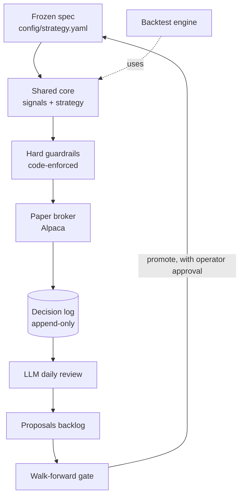

# Architecture

## The two loops

The system is two loops that meet at a shared core and a shared log.

The **live loop** runs down the left: the frozen spec drives the shared core,
whose decisions pass the hard guardrails before any order reaches the paper
broker, and everything is written to the decision log.

The **learning loop** runs back up the right: the log feeds the daily LLM review,
which files proposals; proposals pass the walk-forward gate (which runs the
*same* core through the backtest engine); and only a gate-passing, human-approved
change updates the frozen spec.

## The shared-core wall

`core/signals.py` and `core/strategy.py` are imported unchanged by both
`live/runner.py` and `backtest/engine.py`. `core/strategy.py` is a **pure
function** — no I/O, no clock, no network — so the same inputs always produce the
same decision in both worlds. This is the property the whole layout protects: if
the backtest and live ever disagree given identical inputs, it is a data-plumbing
bug, not a strategy mismatch.

## Components

| Area | Files | Role |
|------|-------|------|
| Core (shared) | `core/signals.py`, `core/strategy.py` | News → Signal → Decision. Pure, shared by live + backtest. |
| Core (data) | `core/schema.py`, `core/logstore.py` | Record types (the backbone) and the append-only log. |
| Core (universe) | `core/universe.py` | Categorized universe; per-ticker category + stop-loss. |
| Risk | `core/guardrails.py` | Hard, code-enforced limits in the execution path. |
| Change state | `core/proposals.py` | Proposal state machine — the only path to a change. |
| Execution | `core/broker.py`, `data/news.py` | Alpaca broker + news (interfaces; Alpaca wiring stubbed). |
| Live | `live/runner.py` | Thin loop: news → core → guardrails → broker → log. |
| Backtest | `backtest/engine.py`, `fills.py`, `walkforward.py` | Point-in-time replay, cost model, the promotion gate. |
| Learning | `analysis/llm_review.py` | Reads logs, proposes gated changes. |
| Reports | `reports/daily.py`, `reports/periodic.py` | Daily / weekly / monthly summaries. |
| Ops | `ops/approval.py`, `deploy.py`, `trial.py`, `change_pipeline.py` | Telegram transport, versioned deploy/revert, shadow trial, orchestration. |
| Entrypoint | `cli.py` | One command surface for every scheduled/long-running job. |
| Agent | `CLAUDE.md`, `.claude/rules/`, `.claude/skills/` | How Claude Code is allowed to operate the repo. |

## Where state lives

All durable state lives under `state/` (the decision log, the proposals backlog,
versioned configs, the live-version pointer). `state/` is the contract between the
always-on instance and GitHub Actions: the instance pushes it to the repo, Actions
read it. See [operations.md](operations.md).
