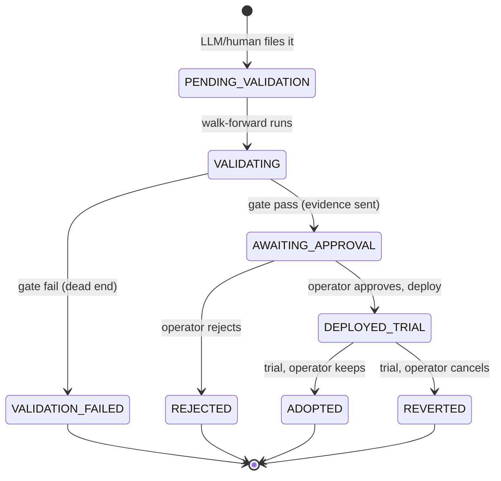

# Change pipeline

No edit reaches the live strategy in place. A change runs a fixed gauntlet, and
the *operator* owns every decision that isn't pure validation. The ordering is the
point: walk-forward runs **before** operator approval, so approval is given on
out-of-sample evidence, not a hunch.

## State machine

Enforced by `core/proposals.py` — illegal jumps are rejected, so even a buggy
orchestrator cannot skip a gate.

## The stages

**1. Proposal.** The daily LLM review (`analysis/llm_review.py`) or the operator
files a `ChangeProposal` naming one parameter, a hypothesis, the evidence, and its
sample size. It lands as `PENDING_VALIDATION`. The LLM has no path past this point.

**2. Walk-forward gate** (`backtest/walkforward.py`, run by the `walk-forward`
job). The candidate is validated on rolling out-of-sample folds and must clear the
`promote()` bar *and* beat the incumbent out-of-sample. Failure → `VALIDATION_FAILED`
(kept as data). Pass → `AWAITING_APPROVAL`, and the proposal is sent to the
operator via Telegram **with its out-of-sample evidence attached**.

**3. Human approval.** The operator taps Approve or Reject (or types the command).
Reject →
`REJECTED`. Approve → the candidate config is deployed as a new version and the
proposal enters `DEPLOYED_TRIAL`.

**4. Shadow A/B trial** (`ops/trial.py`, `change_workflow.trial_days` = 14). The
new version trades live; the previous version runs in **shadow** — it evaluates
the same signals and logs `shadow_decision`s but submits no orders. Same tape, a
real A/B, not "this fortnight vs some past fortnight."

**5. Keep or revert.** When the window closes the operator receives a trial report (candidate
traded vs incumbent shadow, plus a live-vs-backtest sanity note). Keep → `ADOPTED`.
Cancel → `Deployer.revert_to(incumbent)` and `REVERTED`. Revert is lossless because
every version is saved and every decision is stamped with its version + config hash.

## What the trial is and isn't

The 2-week trial is **monitoring and confirmation**, never proof. The walk-forward
gate already tested whether the edge is real; two weeks of P&L is far too small a
sample for that. The trial answers a different question: does live behave like the
backtest promised — is slippage worse than modeled, are fills surprising, did
anything break? Read the live-vs-backtest *divergence*, not the P&L sign.

## Wiring note

A small scheduled check should detect when a trial window has just closed and send
the Keep/Cancel prompt once (a natural addition to the daily-report job). Today the
trial report is sent when `finalize` runs; the listener handles the operator's reply.
