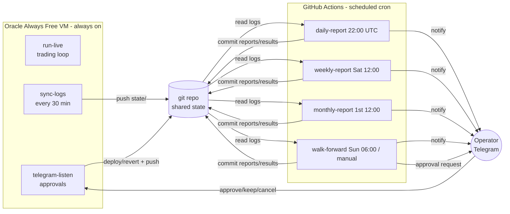

# Operations

## Where things run

The division falls out of *where the data lives*: the live logs are produced on
the instance, so the always-on work (trading, the Telegram listener, log sync)
lives there; the periodic, stateless-ish work (reports, walk-forward, which fetches
its own history from Alpaca) lives in Actions. The git repo is the shared store.
Approvals route through the instance listener because Actions are ephemeral and
can't wait for a human.

## Hosting

**Oracle Cloud Always Free**, an AMD `VM.Standard.E2.1.Micro` running Ubuntu.
Chosen over Google's e2-micro mainly for egress headroom (Google's free tier caps
egress at ~1 GB/month, which an always-on streaming bot would exceed). No SLA on
the free tier — but `state/` is pushed to git, so a lost VM loses nothing
permanent. Full setup steps are in [`../deploy/HOSTING.md`](../deploy/HOSTING.md).

## The CLI

One entrypoint, `cli.py`, with subcommands grouped by where they run:

- **Instance (systemd):** `run-live`, `telegram-listen`, `sync-logs`
- **Actions (cron):** `daily-report`, `weekly-report`, `monthly-report`, `walk-forward`

Instance services are in `deploy/`: `sentiment-bot.service` (loop),
`sentiment-telegram.service` (listener), `sentiment-sync.service` +
`sentiment-sync.timer` (state push). Workflows are in `.github/workflows/`.

## Telegram

A bot is created via @BotFather (which provides the token); the operator's numeric
chat ID is obtained from @userinfobot. The listener honors commands **only** from
that chat ID, so the ID doubles as the access lock. There are four notification
types — daily, weekly, and monthly reports, and proposal/trial approval requests
with inline buttons.

## Cost

VM and Actions are free. The only spend is the daily LLM review — a couple
thousand input tokens and ~1.5k out, well under a dollar a month, billed to the
Anthropic **API** account, separate from the Claude subscription. Walk-forward,
reports, and approvals use no LLM. Use a Haiku-class model for the review to make
it cheaper still.

## Caveats

- Actions cron is best-effort (can be delayed) and auto-disables after ~60 days of
  repo inactivity. Fine for reports; the live loop therefore stays on the instance.
- Equity orders only fire during market hours (the loop checks); crypto is 24/7.
- All cron times are UTC.

## Wiring points (stubbed, must be completed before first paper trade)

| Where | Needs |
|-------|-------|
| `core/broker.py` | `AlpacaPaperBroker` wired to current `alpaca-py` (paper endpoint). |
| `data/news.py` | `AlpacaNews` wired to Alpaca's news API (historical + stream). |
| `live/runner.py` `_volume_zscore` | Real volume z-score from trailing bars. |
| `backtest/engine.py` `price_at` / `volume_z_at` | Point-in-time bar lookups (no future data). |
| `cli.py` `_build_backtest_fn` | A `backtest_fn` loading Alpaca history for the window. |
| stop fills | Reconciliation that logs broker-side stop fills as stop exits. |
| trial close | Scheduled check that sends the Keep/Cancel prompt when a window closes. |
