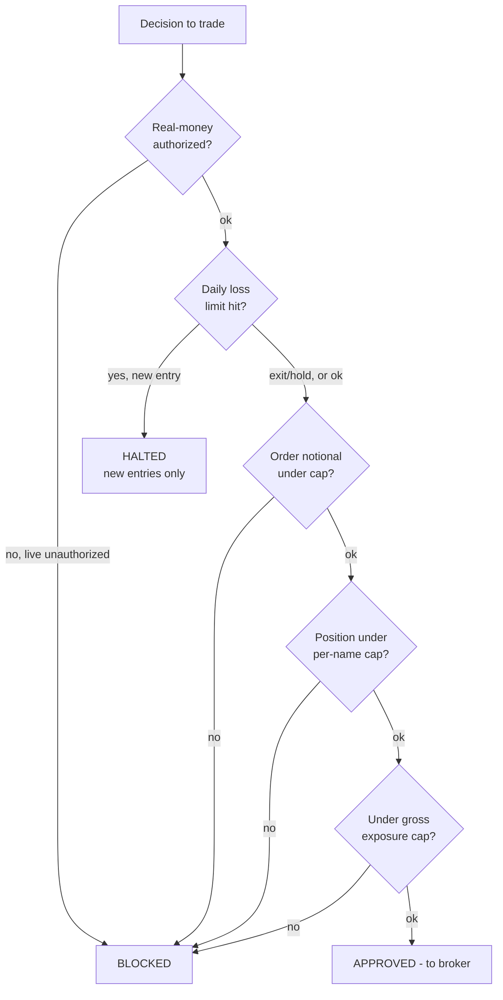

# Risk & guardrails

Two tiers exist, and only the first actually stops a trade.

- **Hard tier** (`core/guardrails.py`): deterministic code in the execution path.
  The strategy and the LLM cannot bypass it.
- **Soft tier** (`CLAUDE.md`, `.claude/rules/`): instructions that shape how the
  Claude Code agent behaves. Enforces nothing at runtime. See [agent.md](agent.md).

This doc is the hard tier.

## Evaluation order

Every actionable decision passes through the guardrails *after* the strategy
decides and *before* the broker sees it. Order matters as much as the values:

The key property: the kill switch and the caps apply only to **new entries**.
Exits and holds are always allowed, so a bad day can never block the closing of an
open position.

## The limits

Defined in `config/strategy.yaml` under `risk_limits`, defaults mirrored in
`core/guardrails.py`:

| Limit | Value | Purpose |
|-------|-------|---------|
| `allow_real_money` | `false` | Real-money interlock. The agent can never flip it; going live is a deliberate human act. |
| `max_daily_loss_pct` | `0.06` | Kill switch: halts new entries once the account is down 6% on the day. |
| `max_order_notional` | `10000` | Absolute per-order ceiling (fat-finger stop). |
| `max_position_pct` | `0.05` | Per-name cap. Defense-in-depth — the strategy also sizes to this. |
| `max_gross_exposure_pct` | `0.90` | Total deployed capital cap. |

There is **no position-count cap**: how many names to hold, and the blend across
categories, is the strategy's call. Concentration is bounded only by the per-name
and gross caps — ruin-prevention, not a prescription of the mix.

## Stop-losses

Per-category stop-losses are defined under `categories.*.stop_loss_pct`:

| Category | Stop |
|----------|------|
| Equities | 6% |
| Crypto | 12% (wider — a tight stop would trip on crypto's normal range) |
| Commodities | 4% |

Stops are enforced **broker-side**: at entry the runner computes the stop price
from the ticker's category and submits a bracket order, so the stop fires on
Alpaca's servers even if the bot process is down. When a broker-side stop fills,
the position-reconciliation poll must log it as a stop exit so the decision log
stays complete (a marked wiring point).

The backtest honors the same stops so live and backtest agree on *when* one fires.
**Limitation:** the backtest checks stops at each ticker's news-event timestamps,
not every price bar, so stop timing is approximate. Tick/bar-accurate stops need
bar-level stepping, which arrives with the price-bar plumbing.
